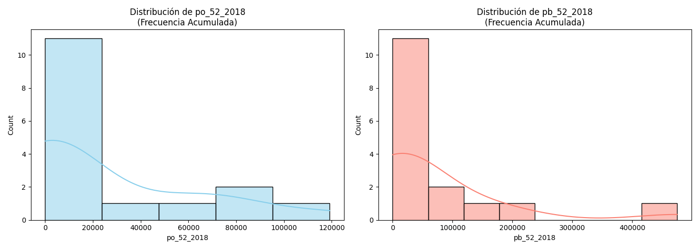
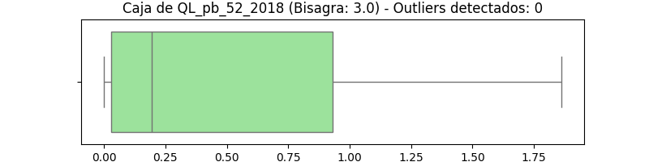
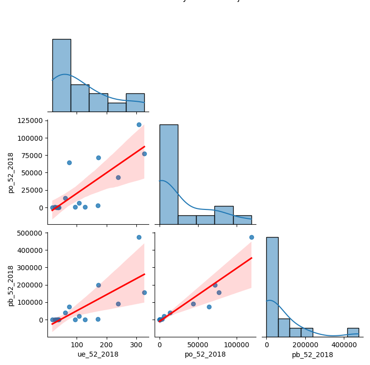
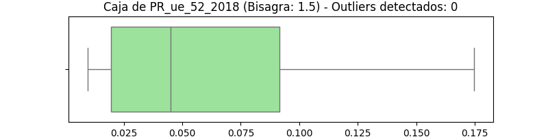

# Análisis Espacial y de Riesgo Comercial del Sector Financiero en la CDMX (Sector 52 - INEGI)


---

## Resumen Ejecutivo y Valor de Negocio

El Sector Financiero y de Seguros (Sector 52) en la Ciudad de México opera bajo una dinámica territorial caracterizada por la regla del **"ganador se lo lleva todo"**. A través de un *pipeline* automatizado en Python, este proyecto transforma datos heterogéneos y censales del INEGI para evaluar la distribución de la infraestructura física, el capital humano y la riqueza generada a nivel municipal/alcaldía.

### Aplicaciones de Negocio:
* **Prospectación e Inteligencia Comercial B2B:** Identificación geomarketing de clusters hiperdensos de alto valor para enfocar esfuerzos de ventas enterprise, omitiendo zonas periféricas con alto despliegue de sucursales pero nulo poder corporativo.
* **Análisis de Riesgo Crediticio e Inmobiliario:** Evaluación de la estabilidad territorial; el riesgo de crédito corporativo e inmobiliario no se distribuye linealmente, sino que se concentra espacialmente en un ecosistema encapsulado.
* **Automatización y Arquitectura ETL:** Desarrollo de un motor modular capaz de limpiar, transformar e imputar matrices espaciales incompletas sin pérdida de geometría espacial.

---

## Arquitectura de Datos y Pipeline ETL

El primer gran reto técnico consistió en procesar la base bruta del INEGI, la cual presentaba estructuras multinivel, texto no estandarizado y omisión de datos por confidencialidad.

```
┌────────────────────────┐      ┌──────────────────────────┐      ┌──────────────────────────┐
│  Datos Crudos INEGI    │ ───> │  Script ETL (etl_esp.py) │ ───> │ Base Ancha Limpia        │
│  (Excel/CSV Multinivel)│      │  - Regex / Cleaning      │      │ (212 Variables / 16 Mpios)│
└────────────────────────┘      │  - Feature Eng (QL, PR)  │      └──────────────────────────┘
                                │  - Pivot & fill_value=0  │
                                └──────────────────────────┘
```

### Decisiones Clave de Ingeniería de Datos (`etl_esp.py`):
1. **Limpieza con Expresiones Regulares (`re`):** Extracción automatizada de claves geográficas (`cve_geo`) a 5 dígitos y códigos de actividad económica (`cve_act`) para asegurar congruencia relacional.
2. **Ingeniería de Características:** Cálculo vectorial al vuelo del **Cociente de Localización ($QL$)** y la **Participación Relativa ($PR$)**:
$$QL_{i,k} = \frac{e_{i,k} / \sum_k e_{i,k}}{\sum_i e_{i,k} / \sum_i \sum_k e_{i,k}}$$
3. **Imputación Espacial Reutilizable (`fill_value=0`):** Para evitar "agujeros" geográficos en el cruce vectorial (Shapefiles), se aplicó una tabla dinámica (`pivot_table`) imputando ceros estructurales donde la rama económica no tenía presencia física reportada.

```python
# Fragmento del Pipeline ETL: Creación de la Base Ancha sin pérdida de geometría
base_ancha = pd.pivot_table(
    df_calc, 
    index=['cve_geo', 'nom_mun'], 
    columns=['cve_act', 'anio'], 
    values=vars_pivot, 
    fill_value=0  # Garantiza la integridad de la matriz territorial
)
```

---

## Análisis Exploratorio de Datos Espaciales (EDA)

El análisis se estructuró mediante la metodología de los **Cuatro ejes Analíticos**:
1. **Economista:** Evaluación de economías de aglomeración y modelo Centro-Periferia.
2. **Inversor / Decision-Maker:** Eficiencia en asignación de capital e inteligencia comercial.
3. **Analista de Datos / Econometrista:** Validación de supuestos matemáticos (sesgo, curtosis, varianza).
4. **Programador / Software Engineer:** Robustez del código, escalabilidad OOP y visualización.

---

### 1. Estadística Descriptiva y Explosión de la Varianza

| Variable | Count | Mean | Std | Min | 25% | 50% (Mediana) | 75% | Max | CV (Varianza) |
| :--- | :---: | :---: | :---: | :---: | :---: | :---: | :---: | :---: | :---: |
| **`ue_52_2018`** | 16.0 | 117.00 | 100.51 | 18.0 | 36.75 | 84.00 | 171.25 | 327.00 | **0.85** |
| **`po_52_2018`** | 16.0 | 25,093.81 | 37,830.99 | 0.0 | 232.75 | 1,966.50 | 48,659.25 | 119,156.00 | **1.50** |
| **`pb_52_2018`** | 16.0 | 66,019.41 | 125,205.85 | 0.0 | 339.91 | 1,198.62 | 77,826.21 | 475,017.23 | **1.89** |
| **`va_52_2018`** | 16.0 | 42,915.84 | 88,431.30 | 0.0 | 152.70 | 611.78 | 31,929.20 | 334,650.62 | **2.06** |

#### Hallazgos Clave:
* **Como Economista- La ilusión de la sucursal vs. El peso del corporativo:** Las Unidades Económicas (`ue`) están dispersas por toda la ciudad (mínimo de 18 sucursales hasta en la alcaldía más remota, $CV = 0.85$). Sin embargo, el Valor Agregado (`va`) exhibe un desbalance brutal: la mediana es de apenas $611$ mdp, mientras que el nodo dominante alcanza $334,650$ mdp. La infraestructura física capta clientes en la periferia, pero el capital de alto valor se aglomera en polos corporativos cerrados.
* **Como Inversor- Un mercado de "El ganador se lo lleva todo":** El 75% de las alcaldías concentra solo hasta 48,000 empleados, pero el máximo salta a 119,156. Para estrategias B2B o desarrollos inmobiliarios corporativos, el mercado objetivo real se reduce a 2 o 3 alcaldías. Asignar recursos fuera de este cluster consolidado representa un costo de oportunidad elevado.
* **Como Analista de Datos- La explosión de la varianza:** El Coeficiente de Variación ($CV = \text{std}/\text{mean}$) escala aceleradamente desde $0.85$ en sucursales hasta $2.06$ en Valor Agregado. En Producción Bruta (`pb`), la media ($66,019$) supera por más de 50 veces a la mediana ($1,198$). Esto evidencia un Sesgo a la Derecha (*Right Skew*) severo que destruiría los supuestos de un modelo de regresión lineal clásico sin transformaciones previas.
* **Como Programador- Integridad relacional:** La columna `count` marca $16.0$ en todas las variables y el `min` en $0.0$, confirmando que la lógica `fill_value=0` en la fase de pivotaje previno la aparición de celdas vacías (`NaN`) que colapsarían el análisis espacial.

---

### 2. Análisis de Distribuciones: Asimetría Severa



#### Hallazgos Clave:
* **Como Economista- Asimetría entre trabajo y capital:** La curva del Personal Ocupado (`po`, azul) decae de forma relativamente suave hacia los 100,000 empleados. En contraste, la Producción Bruta (`pb`, roja) cae en picada inmediata hacia el cero. El empleo operativo requiere presencia física en el territorio; la acumulación de capital está masivamente concentrada.
* **Como Inversor- Cazando en la Cola Larga:** El 80%-90% del territorio compite por márgenes reducidos (el pico a la izquierda). El valor real para un inversor institucional se localiza exclusivamente en la cola larga de la derecha.
* **Como Analista de Datos- Trabajar sin la Campana de Gauss:** El gráfico demuestra distribuciones leptocúrticas con asimetría positiva extrema. Esto justifica formalmente el uso de transformaciones logarítmicas ($\ln y$) antes de implementar estimaciones econométricas.
* **Como Programador. Optimización UI/UX:** El gráfico evidencia cómo la escala lineal comprime 14 alcaldías en las primeras barras. Para tableros interactivos futuros, se recomienda aplicar escala logarítmica en los ejes (`plt.xscale('log')`).

---

### 3. Detección de Outliers y Especialización Territorial

<p align="center">
  
</p>

<p align="center">
  
</p>

#### Hallazgos Clave:
* **Como Economista- La especialización es un club exclusivo:** En la Participación Relativa (`PR_ue`), la caja del diagrama es amplia y visible. No obstante, en el Cociente de Localización de Producción Bruta (`QL_pb`), la caja se aplasta por completo contra el cero, dejando únicamente puntos atípicos (*outliers*) aislados en el extremo derecho. Tener sucursales no implica especialización económica real; la riqueza no se derrama, se encapsula.

---

### 4. Relaciones Bivariadas y Fracaso de Modelos Lineales Tradicionales



#### Hallazgos Clave:
* **Como Analista de Datos & Econometrista- Distorsión por Puntos de Apalancamiento:** Los gráficos de dispersión muestran que los modelos de Mínimos Cuadrados Ordinarios (MCO) aplicados a variables crudas son arrastrados por observaciones atípicas extremas (*leverage points*), sesgando las pendientes de regresión y distorsionando los p-valores.

---

### 5. Agrupaciones Espaciales y Algoritmos de Clasificación

Para evitar sesgos en la representación cartográfica, se compararon métodos de estratificación sobre el indicador $QL_{po}$:

```
>> CUANTILES (Distribución forzada de igual frecuencia):
[0.00, 0.04] | Count: 4
(0.04, 0.12] | Count: 4
(0.12, 1.12] | Count: 4
(1.12, 3.22] | Count: 4

>> CORTES NATURALES - FISHER-JENKS (Optimización de varianza intra-grupo):
[0.00, 0.37] | Count: 10  <-- Agrupa la periferia no especializada
(0.37, 1.21] | Count: 3   <-- Zona de transición
(1.21, 1.90] | Count: 2   <-- Polo secundario
(1.90, 3.22] | Count: 1   <-- EL MONSTRUO CORPORATIVO (Máxima concentración)
```



#### Hallazgos Clave:
* **Como Programador & Analista Espacial — Cuantiles vs. Fisher-Jenks:** El método de Cuantiles enmascara la realidad al forzar 4 municipios por rango. El algoritmo de **Fisher-Jenks** minimiza la varianza interna y aísla con precisión las 10 alcaldías periféricas sin especialización, identificando con claridad el nodo corporativo principal en el intervalo $[1.90, 3.22]$.

---

## Estructura del Repositorio y Uso

```bash
├── assets/                          # Gráficas y mapas exportados
│   ├── 01_distribucion_asimetrica_po_vs_pb.png
│   ├── 02_outliers_especializacion_boxplots.png
│   ├── 03_relaciones_bivariadas_mco.png
│   ├── 04_mapa_agrupaciones_pr_ue.png
│   └── 05_outliers_ql_pb_boxplots.png
├── etl_esp.py                       # Pipeline de procesamiento y limpieza INEGI
├── cal_eda_mod.py                   # Módulo OOP para EDA y Clasificación Espacial
├── Base_Ancha_CDMX.csv              # Dataset procesado (212 variables)
└── README.md                        # Documentación del proyecto
```

### Ejecución del Proyecto:

1. **Requisitos de Entorno:**
```bash
pip install pandas numpy matplotlib seaborn geopandas mapclassify
```

2. **Ejecutar el Pipeline ETL:**
```python
from etl_esp import generar_base_ancha
df_limpio = generar_base_ancha('ruta_a_tu_archivo_inegi.xlsx')
```

3. **Ejecutar el Análisis Exploratorio Modulado:**
```python
python cal_eda_mod.py
```

---

## Autor

* **Miguel Ángel Cortés Monge**
* **Universidad:** Universidad Autónoma Metropolitana (UAM Azcapotzalco)
* **Perfil:** Econometrista & Analista de Datos
* **Áreas de Especialidad:** Análisis de Datos, Inteligencia Comercial B2B, Análisis de Riesgo Territorial, Econometría Espacial, Pipeline Automático ETL.
